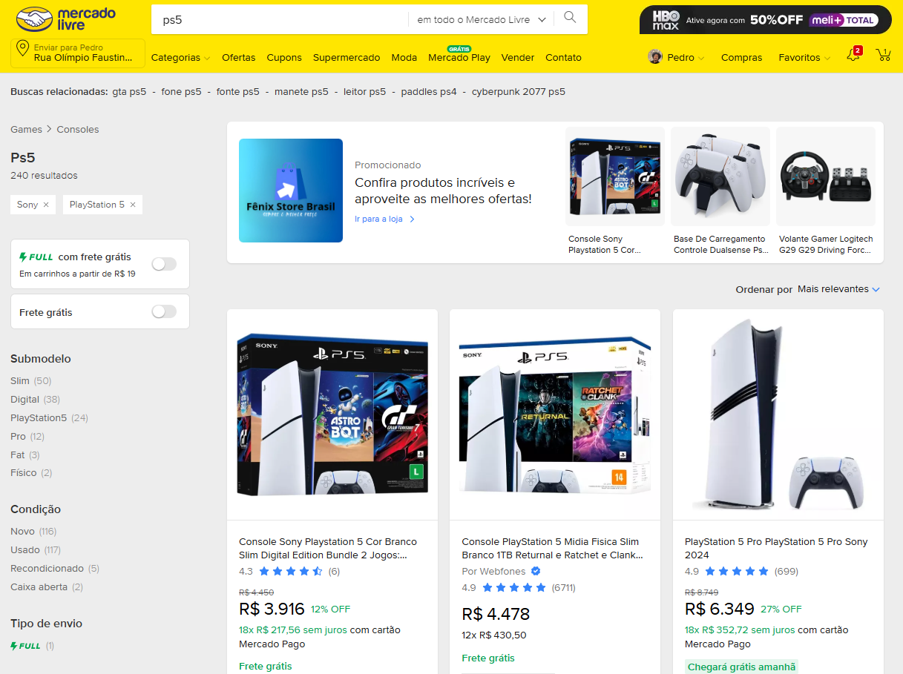
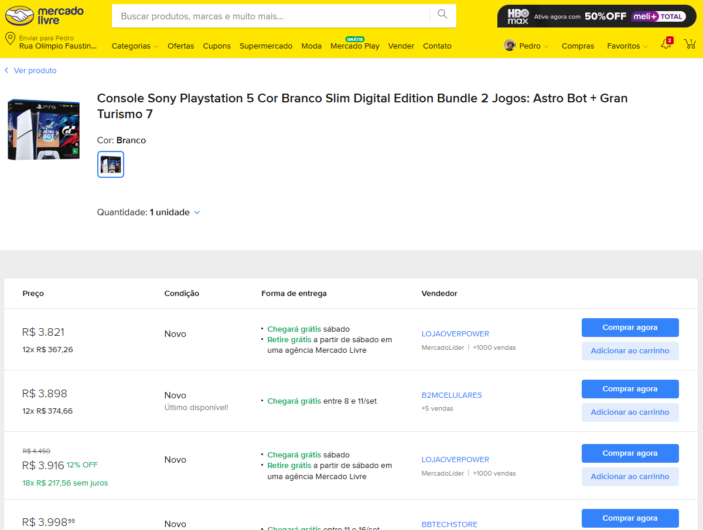
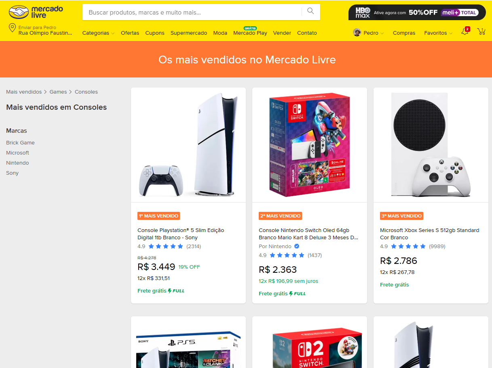
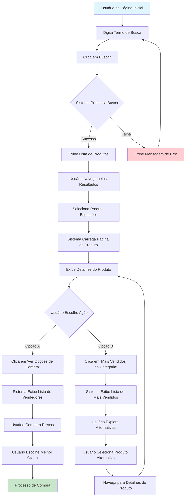

# Caso de Uso: Consulta e Navegação de Produtos no Mercado Livre

## 📋 Informações do Caso de Uso

**Identificador**: UC-001  
**Nome**: Consulta e Navegação de Produtos  
**Ator Principal**: Usuário do Sistema  
**Ator Secundário**: Sistema de Busca do Mercado Livre  
**Prioridade**: Alta  
**Frequência**: Muito Alta  

## 🎯 Descrição

Este caso de uso descreve o processo completo pelo qual um usuário realiza uma busca por produtos no sistema, navega pelos resultados, seleciona um produto específico e acessa opções de compra ou lista de mais vendidos na categoria.

## 📱 Pré-condições

- O usuário está na página inicial do sistema
- O sistema está funcionando normalmente
- A conexão com a API do Mercado Livre está ativa
- O usuário possui acesso à internet

## 🔄 Fluxo Principal

### 1. **Usuário realiza busca no site**
- **Ação**: Usuário acessa a interface de busca
- **Referência Visual**: `@busca.png`
- **Descrição**: 
  - Usuário digita termo de busca (ex: "PlayStation 5", "PS5", "Console Sony")
  - Sistema valida entrada e processa busca
  - Sistema consulta API do Mercado Livre

*Interface de busca do Mercado Livre com barra de pesquisa e navegação principal*

### 2. **Sistema exibe lista de produtos**
- **Ação**: Sistema processa busca e retorna resultados
- **Referência Visual**: `@resultado-pesquisa.png`
- **Descrição**:
  - Sistema exibe lista paginada de produtos encontrados
  - Cada produto mostra: imagem, título, preço, vendedor, avaliação
  - Sistema aplica filtros de relevância e disponibilidade
  - Usuário pode navegar pelos resultados

*Lista de produtos encontrados na busca, com informações de preço, vendedor e avaliações*

### 3. **Usuário seleciona um produto**
- **Ação**: Usuário clica em produto específico da lista
- **Descrição**:
  - Usuário identifica produto de interesse
  - Clica na imagem ou título do produto
  - Sistema registra seleção para análise de comportamento

### 4. **Sistema exibe página do produto selecionado**
- **Ação**: Sistema carrega página de detalhes do produto
- **Referência Visual**: `@produto-selecionado.png`
- **Descrição**:
  - Sistema exibe informações detalhadas do produto
  - Mostra: imagens, especificações, preço, vendedor, avaliações
  - Apresenta botões de ação: "Ver opções de compra" e "Mais vendidos na categoria"

*Página de detalhes do produto com informações completas e botões de ação*

### 5. **Usuário escolhe ação de navegação**

#### 5.1 **Opção A: Ver opções de compra**
- **Ação**: Usuário clica em "Ver opções de compra"
- **Referência Visual**: `@produto-lista-opcoes-compra.png`
- **Descrição**:
  - Sistema exibe lista de diferentes vendedores para o mesmo produto
  - Cada opção mostra: preço, condição, frete, vendedor, avaliação
  - Usuário pode comparar preços e escolher melhor oferta

*Lista de diferentes vendedores para o mesmo produto com comparação de preços*

#### 5.2 **Opção B: Mais vendidos na categoria**
- **Ação**: Usuário clica em "Mais vendidos na categoria"
- **Referência Visual**: `@produto-lista-mais-vendidos.png`
- **Descrição**:
  - Sistema exibe lista dos produtos mais vendidos na categoria
  - Produtos ordenados por volume de vendas e avaliações
  - Usuário pode descobrir alternativas populares

*Lista dos produtos mais vendidos na categoria com rankings e informações de vendas*

## 📱 Diagrama do Fluxo

**Versão**: 1.0  
**Data de Criação**: 20/08/2025  
**Responsável**: Pedro Almeida
**Revisão**: v0.20.08.2025
